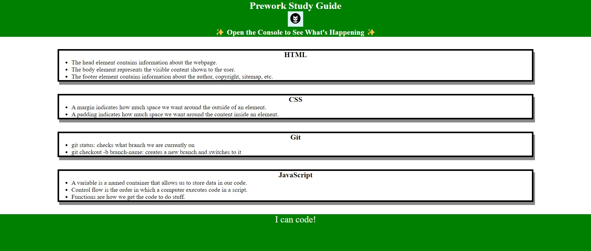

# Prework Study Guide

## Description

I created a study guide to help bootcamp students get started to learn about coding. It shows a few of my notes from my Prework learning to give a view of what learning about it will be like. I used HTML, CSS, and basic JavaScript to create this page.

## Installation

No installation necessary but you can clone the [repository](https://github.com/MrMessyFace/prework-study-guide) from GitHub to edit it and make your own version.

## Usage

Each section contains notes for the four topics to be learned, HTML, CSS, JavaScript, and Git. If you open the DevTools console, you can see the JavaScript running. It lists the topics we learned from prework and chooses one topic to study first.

## Credits

This project was created using instructions from the Prework Module of the Northwestern University Full Stack Coding Bootcamp.

## License

## Helpful Links

- [Repository](https://github.com/MrMessyFace/prework-study-guide)
- [Live App](https://mrmessyface.github.io/prework-study-guide/)

&copy; 2023 Jessie S. Galindo. All Rights Reserved.
