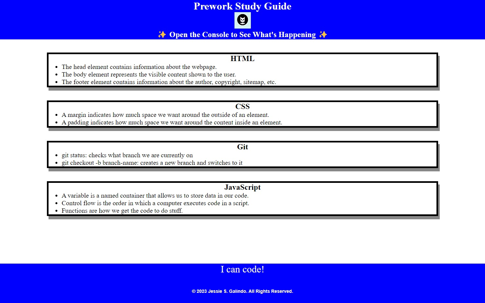

# Prework Study Guide Webpage

## Description

I created a study guide to help bootcamp students get started to learn about coding. It shows a few of my notes from my Prework learning to give a view of what learning about it will be like.

## Installation

I used HTML, CSS, and basic JavaScript.

## Usage

Each section contains notes for the four topics to be learned, HTML, CSS, JavaScript, and Git. If you open the DevTools console, you can see the JavaScript running. It lists the topics we learned from prework and chooses one topic to study first.

## Credits

[Repository](https://github.com/MrMessyFace/prework-study-guide) | [Live App](https://mrmessyface.github.io/prework-study-guide/)

## License

Please refer to the LICENSE in the repo.